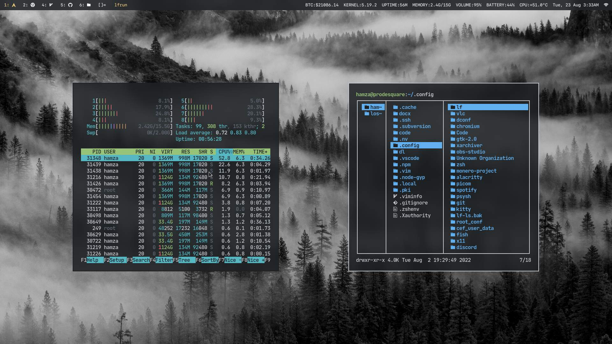

# Hamza Mughal's patch of dwm



dwm is a dynamic window manager for X. Read more about dwm on [suckless' website](http://dwm.suckless.org)

### Highlight on some features

+ Inner & outer padding for statusbar
+ Gaps around windows in all layouts
+ Multiple layout options
    + Tiled
    + Monocle
    + Fibonacci
    + Gridmode
    + Centered Master
    + Deck
    + Bottom Stack
    + Bottom Stack Horizontal

### Fonts used
+ SF Mono Nerd Font

### Dependencies
+ `sxhkd` [(config)](https://github.com/ProDeSquare/dotfiles/blob/master/.config/sxhkd/sxhkdrc)
+ `libxft-bgra`

### How to install
+ Clone this repository into your system.
+ CD into the directory
+ make

```
$ git clone https://github.com/ProDeSquare/dwm.git
$ cd dwm
$ sudo make clean install
```

### Links
[Portfolio](https://prodesquare.com)
